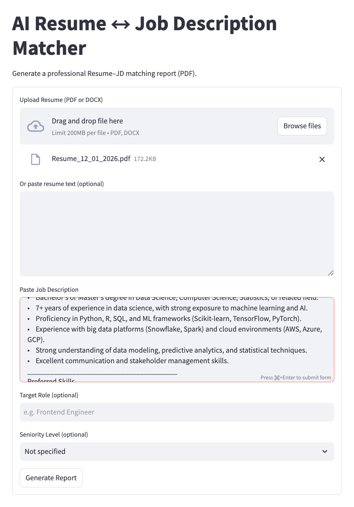
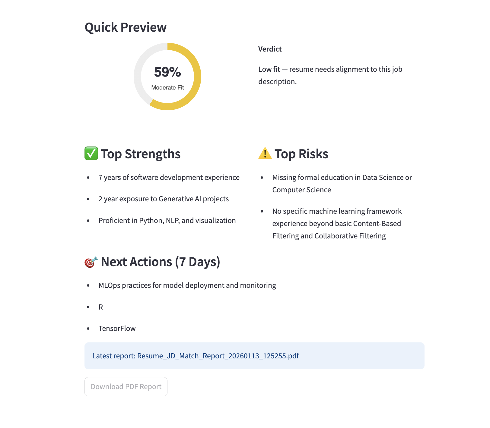

# AI Resume ↔ Job Description Matcher (Offline, Local, Open-Source)

A fully offline Generative AI tool that analyzes a Resume against a Job Description and generates a **professional PDF report** with:
- Resume–JD match score (%)
- Clear verdict (Low / Moderate / Strong fit)
- Key strengths and risks
- Skill gaps and missing requirements
- ATS-friendly bullet rewrites
- Actionable next steps (7-day plan)

No cloud APIs. No backend. No subscriptions.  
Built entirely using **free, local, open-source tools**.

---

## 🚀 Why this project exists

Most resume tools:
- Hide logic behind paid APIs
- Are black-box SaaS products
- Don’t explain *why* a resume is weak

This project focuses on:
- **Transparency**
- **Offline capability**
- **Actionable clarity for non-technical users**

---

## 🧠 How it works (High-level workflow)
Resume + Job Description
↓
Text Extraction & Cleaning
↓
Semantic Similarity Scoring (MiniLM embeddings)
↓
Local LLM Analysis (Ollama)
↓
Quick UI Preview + Detailed PDF Report

---

## 📊 What the user gets

### 1️⃣ Quick UI Preview (no download required)
- Visual match score (circular indicator)
- Clear verdict (Low / Moderate / Strong fit)
- Top strengths
- Top risks
- Top actions for the next 7 days

### 2️⃣ Downloadable PDF Report
- Professional layout
- Resume–JD match score explanation
- Skill gaps and missing requirements
- Section-wise resume feedback
- ATS-friendly bullet point rewrites
- Clear improvement plan

---

## 🛠 Tech Stack (100% Free & Local)

- **Python**
- **Streamlit** – Local UI
- **Ollama** – Local LLM runtime
- **Mistral / Llama 3.x** – Reasoning models
- **sentence-transformers (MiniLM)** – Semantic similarity scoring
- **ReportLab** – PDF generation

---

## 📁 Project Structure
resume_jd_matcher/
│
├── app.py # App router
├── pipeline.py # End-to-end orchestration
│
├── ui_form.py # Input form UI
├── ui_results.py # Results & preview UI
│
├── pdf/
│ ├── pdf_builder.py # PDF orchestrator
│ ├── pdf_layout.py # Layout helpers
│ ├── pdf_scorebar.py # Visual score bar
│ └── pdf_utils.py
│
├── ollama_client.py
├── llm_runner.py
├── llm_prompts.py
│
└── outputs/ # Generated PDF reports

---

## ▶️ How to run locally

### 1️⃣ Install dependencies
pip install streamlit sentence-transformers reportlab

### 2️⃣ Install & start Ollama
brew install ollama
ollama pull mistral:7b

### 3️⃣ Run the application
streamlit run app.py --server.fileWatcherType none
---
## 📸 Screenshots

### Home / Upload

### Match Score & Analysis

## License
MIT License
